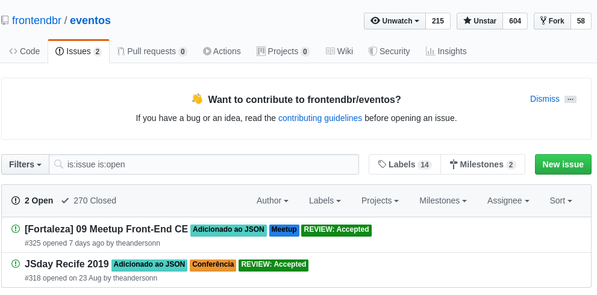

# GitHub as *

---

## DFT DevHub

(Nome a definir)<!-- .element: class="fragment" data-fragment-index="1" -->

---

não esquecer do amiguinho backend

---

centralizar coisas de dev no GitHub

----

deixar o que é coisa de tarefa no Jira

----

ter histórico, tags etc

(Slack não tem)<!-- .element: class="fragment" data-fragment-index="1" -->

💔<!-- .element: class="fragment" data-fragment-index="2" -->

---

Postar Dúvidas e gerar discussões?

[frontendbr/forum](https://github.com/frontendbr/forum/issues)

---

Postar Links?

[BrazilJS/weekly](https://github.com/braziljs/weekly/issues?q=is%3Aissue+is%3Aclosed)

---

Eventos?

[frontendbr/eventos](https://github.com/frontendbr/eventos/issues)

---

Iniciativas internas?

Eventos?<!-- .element: class="fragment" data-fragment-index="1" -->

----

criar, testar, apagar o que não der certo
