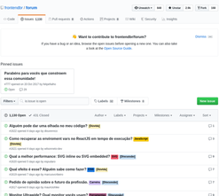
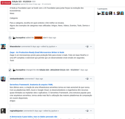

## Frontend Proposals

---

## Guildas

----

Frequência a ser definida

<small><small><small>Quinzenal?</small></small></small><!-- .element: class="fragment" data-fragment-index="1" -->

----

Se crescer, usar [sli.do](https://www.sli.do/)

----

---

## GitHub as Forum

----

### DFT DevHub

----

não esquecer do amiguinho backend

----

centralizar coisas de dev no GitHub

----

deixar o que é coisa de tarefa no Jira

----

ter histórico, tags etc

(Slack não tem)<!-- .element: class="fragment" data-fragment-index="1" -->

💔<!-- .element: class="fragment" data-fragment-index="2" -->

----

Dúvidas?

[frontendbr/forum](https://github.com/frontendbr/forum/issues)

----

Links?

[BrazilJS/weekly](https://github.com/braziljs/weekly/issues?q=is%3Aissue+is%3Aclosed)

----

Iniciativas?

----

criar, testar, apagar o que não der certo

---

## Design System

----

Mas já temos um repositório de componentes!

----

Tem que ser algo em conjunto com o time de UI/UX

----

Por que não migrar o existente?

----

(Gian ⏰)

----

Tem que surgir junto com eles

----

<small><small>mas na verdade vamos fazer `Ctrl+C`/`Ctrl+V`</small></small>

----

Aproveitar o redesign da Dafiti

----

> Tornar um lugar como verdade para o desenvolvimento de interfaces web

----

v0

----

- Guidelines para Design E Frontend
- Showcase de componentes<!-- .element: class="fragment" data-fragment-index="1" -->
  - Homologados por UI<!-- .element: class="fragment" data-fragment-index="2" -->
  - Bem documentados<!-- .element: class="fragment" data-fragment-index="3" -->
  - Bem testados<!-- .element: class="fragment" data-fragment-index="4" -->
  - Responsivos<!-- .element: class="fragment" data-fragment-index="5" -->
    - (quando não forem adaptativos)<!-- .element: class="fragment" data-fragment-index="6" -->
  - Pensando em<!-- .element: class="fragment" data-fragment-index="7" -->
    - Acessibilidade<!-- .element: class="fragment" data-fragment-index="8" -->
    - Segurança<!-- .element: class="fragment" data-fragment-index="9" -->

----

> Novo design usar Design System !== Design System ser o novo design

----

Preview (Storybook):
- em diferentes temas<!-- .element: class="fragment" data-fragment-index="1" -->
- em diferentes viewports<!-- .element: class="fragment" data-fragment-index="2" -->
- em diferentes idiomas<!-- .element: class="fragment" data-fragment-index="4" -->

----

**Prismic**

----

Não esquecer
- Multisite<!-- .element: class="fragment" data-fragment-index="1" -->
- LATAM<!-- .element: class="fragment" data-fragment-index="2" -->

----

<small>tentar dominar o mundo</small>

----

---

todo mundo é foda aqui!

---

valeus!
